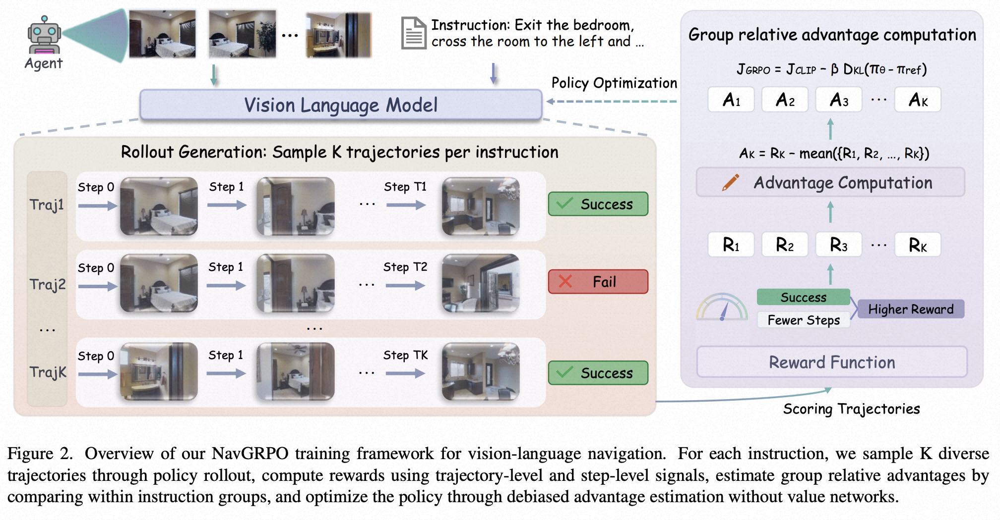

# Trajectory-Diversity-Driven Robust Vision-and-Language Navigation

<p align="left">
  <a href="https://arxiv.org/abs/XXXX.XXXXX"></a>
  <a href="LICENSE"></a>
</p>

## 🔥 Highlights

- **NavGRPO** is a reinforcement learning framework for VLN that uses **Group Relative Policy Optimization (GRPO)** to learn from diverse trajectories.
- Achieves **+3.0% SPL** on R2R and **+1.71% SPL** on REVERIE over the ScaleVLN baseline (val unseen).
- Under extreme early-stage perturbations, demonstrates **+14.89% SPL** gain, confirming substantially more robust navigation policies.

---

## 📋 Overview



Vision-and-Language Navigation (VLN) requires agents to navigate photo-realistic environments following natural language instructions. Current methods predominantly rely on imitation learning, which suffers from limited generalization and poor robustness to execution perturbations. We present **NavGRPO**, a reinforcement learning framework that learns goal-directed navigation policies through Group Relative Policy Optimization. By exploring diverse trajectories and optimizing via within-group performance comparisons, our method enables agents to distinguish effective strategies beyond expert paths without requiring additional value networks.

> 🚧 **Code and pretrained models are coming soon. Stay tuned!**


## 📖 Citation

If you find this work helpful, please consider citing:

```bibtex
@article{li2026trajectory,
  title={Trajectory-Diversity-Driven Robust Vision-and-Language Navigation},
  author={Li, Jiangyang and Wan, Cong and Dong, SongLin and Ding, Chenhao and Wang, Qiang and Ma, Zhiheng and Gong, Yihong},
  journal={arXiv preprint arXiv:2603.15370},
  year={2026}
}
